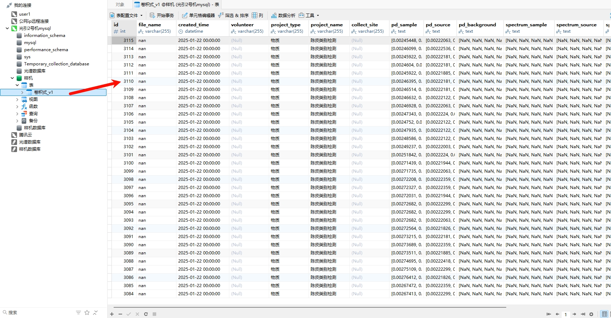
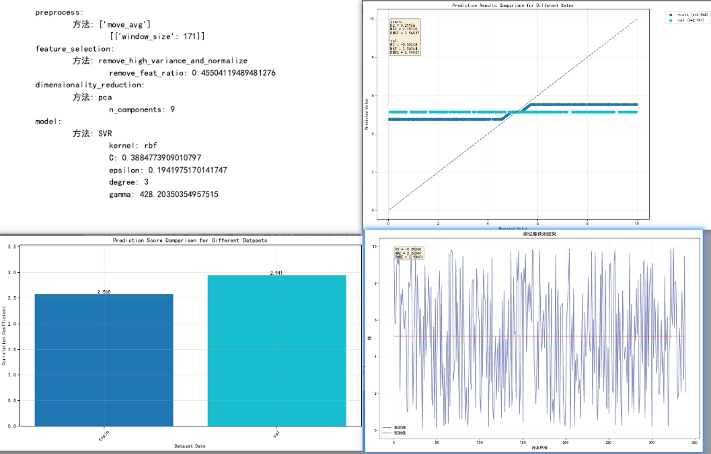

# 介绍

# 使用指南

## AnalysisClass

### Create_rec_task
####  SpectrumModelEvaluator  评估所有类重建的效果

会在当前目录生成一个evaluation_results文件夹，里面包含了所有的评估结果
```python
from nirapi.AnalysisClass.Create_rec_task import SpectrumModelEvaluator
import numpy as np
# Generate dummy data for demonstration
np.random.seed(42)
X_train = np.random.rand(10, 1200)  # 10 samples, 1200 features
y_train = np.random.rand(10, 1200)
X_test = np.random.rand(1, 1200)
y_test = np.random.rand(2, 1200)
    
evaluator = SpectrumModelEvaluator()
results = evaluator.run_evaluation(X_train, y_train, X_test, y_test)

print(f"Plots saved at: {results['plot_path']}")
print(f"Summary document saved at: {results['doc_path']}")
```

#### SpectralDictionaryMapper  使用字典学习进行重建 任何光谱仪都适用
使用方法
```python
from nirapi.AnalysisClass.Create_rec_task import SpectralDictionaryMapper

rec_task = SpectralDictionaryMapper()
import numpy as np
pd_samples= np.random.rand(100,200)
FT_spectra = np.random.rand(100,300)


# 训练,仅仅只是光谱数据，不需要标签
fit = rec_task.fit(pd_samples,FT_spectra)
# 重建

print(pd_samples[0:3].shape)
pred = rec_task.transform(pd_samples[0:3])  # 这里传入的需要是二维的数据
```


#### SpectrumTransformerByNN  使用神经网络进行重建  任何光谱仪都适用
使用方法
```python
from nirapi.AnalysisClass.Create_rec_task import SpectrumTransformerByNN
rec_task = SpectrumTransformerByNN()
import numpy as np
pd_samples= np.random.rand(100,200)
FT_spectra = np.random.rand(100,300)

# 训练,仅仅只是光谱数据，不需要标签
fit = rec_task.fit(pd_samples,FT_spectra)
# 重建
print(pd_samples[0:3].shape)
pred = rec_task.transform(pd_samples[0:3])
```

#### conv_MatMul_recon   矩阵乘法求解， 直接乘以传输矩阵的逆矩阵 适用于卷积式的重建 1200维度
使用方法
```python
from nirapi.AnalysisClass.Create_rec_task import conv_MatMul_recon
import numpy as np


rec_task = conv_MatMul_recon()
pd_samples = np.random.rand(30,1200)  # 传入的特征必须是1200维的
pd_source = np.random.rand(30,1200)

# 不需要训练 
rec_sample,rec_source = rec_task.transform(pd_samples,pd_samples)
```


#### conv_DFT_recon 使用傅里叶变换求解 适用于卷积式的重建1200维度

```python
from nirapi.AnalysisClass.Create_rec_task import conv_DFT_recon

rec_task = conv_DFT_recon()
import numpy as np
pd_samples = np.random.rand(30,1200)
pd_source = np.random.rand(30,1200)
rec_sample,rec_source = rec_task.transform(pd_samples,pd_samples)

print(rec_sample.shape)
print(rec_source.shape)
```

#### FermentPeelVectorReLU  先用字典学习学习一个字典，或者完全不用字典，字典是可选的，然后用一个向量去拟合额外的变换   适用于任何光谱仪 任意维度

```python
from nirapi.AnalysisClass.Create_rec_task import FermentPeelVectorReLU
import numpy as np
rec_task = FermentPeelVectorReLU()

## 首先打开字典，然后训练
PD_Samples = np.random.rand(30,800)
FT_spectra = np.random.rand(30,800)
rec_task.fit(PD_Samples,FT_spectra)
## 然后关闭字典，训练后面的
rec_task.enable_dic = False
rec_task.fit(PD_Samples,FT_spectra)
## 最后打开字典
rec_task.enable_dic = True
pred = rec_task.transform(PD_Samples)
print(pred.shape)
```


#### conv_FullDictDotMat  字典学习，然后用可训练的矩阵拟合额外变换 适用于任何光谱仪 任意维度


```python
from nirapi.AnalysisClass.Create_rec_task import conv_FullDictDotMat
import numpy as np
rec_task = conv_FullDictDotMat()

## 首先打开字典，然后训练
PD_Samples = np.random.rand(30,800)
FT_spectra = np.random.rand(30,800)
rec_task.fit(PD_Samples,FT_spectra)
## 然后关闭字典，训练后面的
rec_task.enable_dic = False
rec_task.fit(PD_Samples,FT_spectra)
## 最后打开字典
rec_task.enable_dic = True
pred = rec_task.transform(PD_Samples)
print(pred.shape)
```


#### ~~conv_multi_rec_func_merge 合并多个rec函数,然后生成一个比较稳定的光谱重建~~ 已被删除 
使用方法
```python
from nirapi.AnalysisClass.Create_rec_task import conv_multi_rec_func_merge


rec_task = conv_multi_rec_func_merge()
# 训练,仅仅只是光谱数据，不需要标签
fit = rec_task.fit(pd_samples,FT_spectra)
# 重建
pred = rec_task.transform(pd_sample,pd_source)
```


## load_data


### transform_xlsx_to_database  将xlsx文件上传到mysql数据库
使用方法：
1. 首先需要使用模板文件，把模板文件填好，文件在examples/template.xlsx
2. 然后上传
```python
from nirapi.load_data import transform_xlsx_to_mysql
df = transform_xlsx_to_mysql(file_path = r'data\template.xlsx',machine_type='卷积式_v1', upload_database = True)
```
参数说明：
- file_path: xlsx文件路径
- machine_type: 光谱仪的类型，目前只支持 "卷积式_v1" ，对应的是数据库中的表名
- upload_database: 是否上传到数据库，默认是True，如果是False，就不会上传到数据库，而是返回一个DataFrame

返回值说明：
- 返回值是一个DataFrame，包含了上传到数据库的数据



### get_wavelength_list  读取商用光谱仪的波长列表

使用方法

```python
get_wavelength_list("FT")
```

参数说明：

---
必填参数
- mechine_type : 光谱仪的类型，目前只支持 "FT" 和 "FX"


### get_dataset_from_mysql  从光引mysql数据库中获取数据集

使用方法
```python
from nir.load_data import get_dataset_from_mysql
dataset_X = get_dataset_from_mysql(database='光谱数据库',table_name="复享光谱仪", project_name="多发光单收光探头血糖数据", X_type=['光谱',"采集日期","志愿者"], )
```
参数说明：

---
必填参数
- database：数据库的名称目前有'光谱数据库'和 '样机数据库',当然具体哪些可以登录数据库查看
- table_name：数据库中的表名
- project_name：项目名称
- X_type：是一个列表，需要获取的光谱数据的类型，目前有'光谱','采集日期','志愿者'，当然具体哪些可以登录数据库查看

---
选填参数
- y_type：是一个列表，需要获取的标签数据的类型，如果不填就默认所有的标签
- strar_time: 采集的最早开始时间，默认： "1970-01-01 00:00:00"
- end_time: 采集的最晚结束时间，默认： "2100-01-01 00:00:00"
- volunteer: 志愿者的名称，例： "张三"，不填的话就会返回所有的志愿者数据
---

返回值说明：
返回的是一个字典：
{
    "光谱"：....,
    "采集日期"：....,
    "志愿者"：....,
    "标签"：....,
    ....
}


### repeat_values_to_csv 将一个numpy数组中的每个元素重复n遍，然后保存到csv中，用于样本重复测量，但是理化值只有一次而要对齐时

args:
    - input_data ：np.array
    - n_repeats ： int
    - output_file ： str
```py
# 示例数据
data = np.array([
    [2.1, 4.151],
    [0.84, 1.762], 
    [0.21, 0.49],
    [1.68, 3.375]
])
# 调用函数重复数据3遍并保存
repeat_values_to_csv(data, n_repeats=30)
```


## utils
### train_model_for_trick_game_v2  自动机器学习，输出文档（ 根据输入的训练测试集数据进行训练和预测，然后输出评价函数的图表和对应的预测值的csv文件


使用方法
```python
import numpy as np
from sklearn.model_selection import train_test_split
import datetime
from nirapi.utils import train_model_for_trick_game_v2

# Generate synthetic data
np.random.seed(42)
n_samples, n_features = 1000, 1000
X = np.random.randn(n_samples, n_features)
y = np.random.uniform(0, 10, n_samples)

# Split data
X_train, X_test, y_train, y_test = train_test_split(X, y, test_size=0.34, random_state=42)

# Define keyword arguments for preprocessing and model selection
kw = {
    "selected_outlier": ["不做异常值去除"],
    "selected_preprocess": ["move_avg"],
    "preprocess_number_input": 1,
    "selected_feat_sec": ["remove_high_variance_and_normalize"],
    "selected_dim_red": ["pca"],
    "selected_model": ["SVR"]
}

# Call the function
result = train_model_for_trick_game_v2(
    splited_data=(X_train, X_test, y_train, y_test),
    max_attempts=5,
    test_size=0.34,
    n_trials=10,
    selected_metric="rmse",
    target_score=0.5,
    filename=datetime.datetime.now().strftime("%Y-%m-%d-%H-%M-%S") + "_example",
    **kw
)

print("Training completed:", result)
```


### get_MZI_bands  获取计算式样机的波长范围

使用方法
```python
from nirapi.utils import get_MZI_bands

print(get_MZI_bands())
```
返回值说明：
返回的是一个列表，包含了计算式样机的波长范围,分成了四段


