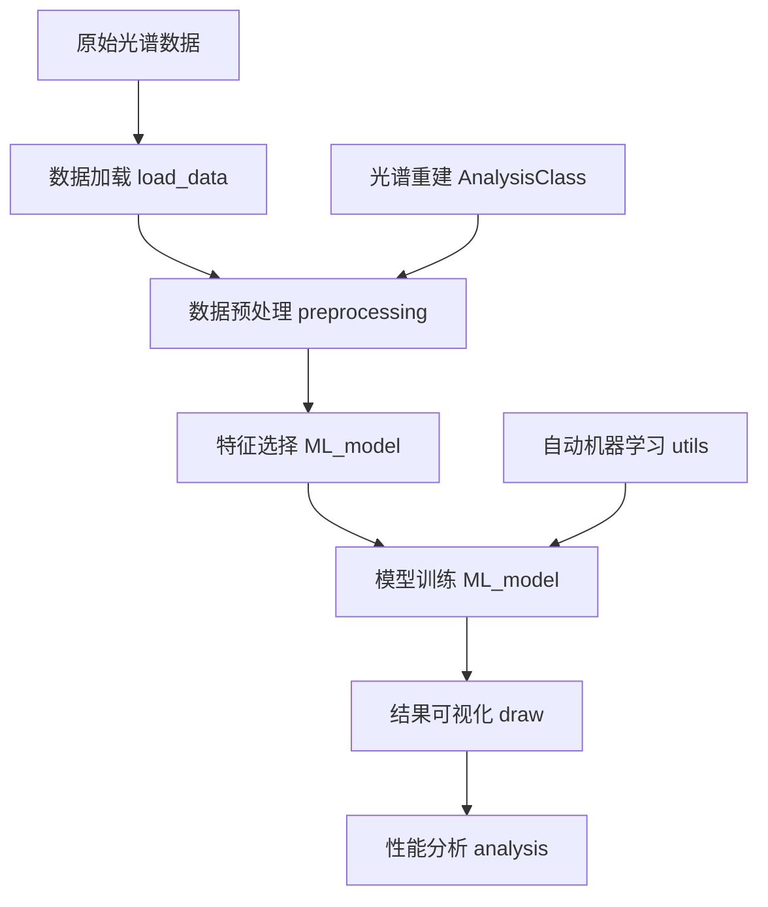

# API 概览

NIR API 提供了一套完整的近红外光谱分析工具。本页面概述了所有可用的模块和主要功能。

## 模块结构

```
nirapi/
├── load_data      # 数据加载和数据库操作
├── preprocessing  # 数据预处理方法
├── ML_model      # 机器学习模型和算法
├── automl        # 自动机器学习工具
├── draw          # 数据可视化功能
├── analysis      # 光谱数据分析工具
├── utils         # 工具函数和实用工具
└── AnalysisClass # 高级分析类和光谱重建
```

## 核心模块

### 🔄 数据加载 (`load_data`)

负责数据的导入、导出和数据库操作。

**主要功能:**
- 从 MySQL 数据库加载光谱数据
- Excel 文件处理和转换
- 模型的保存和加载
- 波长信息管理

**核心函数:**
- `get_dataset_from_mysql()` - 从数据库获取数据集
- `get_wavelength_list()` - 获取光谱仪波长列表
- `save_model()` / `load_model()` - 模型持久化
- `transform_xlsx_to_mysql()` - Excel 数据上传到数据库

### 🔧 数据预处理 (`preprocessing`)

提供各种光谱数据预处理方法。

**主要功能:**
- 标准化和归一化
- 基线校正
- 滤波和平滑
- 异常值检测和移除

**核心函数:**
- `SNV()` - 标准正态变量变换
- `MSC()` - 多元散射校正
- `SG()` - Savitzky-Golay 滤波
- `remove_outliers()` - 异常值移除

### 🤖 机器学习 (`ML_model`)

包含各种机器学习算法和特征选择方法。

**主要功能:**
- 回归和分类模型
- 特征选择算法
- 降维方法
- 模型评估

**核心函数:**
- `PLSR()` - 偏最小二乘回归
- `SVR()` - 支持向量回归
- `cars()` - 竞争性自适应重加权采样
- `pca()` - 主成分分析

### 📊 数据可视化 (`draw`)

提供丰富的数据可视化功能。

**主要功能:**
- 光谱图绘制
- 模型性能可视化
- 统计分析图表
- 交互式图表

**核心函数:**
- `spectral_absorption()` - 光谱吸收图
- `pred_plot()` - 预测结果对比图
- `plot_pca_with_class_distribution()` - PCA 可视化
- `analyze_model_performance()` - 模型性能分析

### 🔬 数据分析 (`analysis`)

专门的光谱数据分析工具。

**主要功能:**
- 光谱数据加载和验证
- 基础统计分析
- 异常值检测
- 相关性分析

**核心函数:**
- `analyze_spectral_data()` - 综合光谱分析
- `load_spectral_data()` - 光谱数据加载
- `detect_outliers()` - 异常值检测
- `analyze_correlations()` - 相关性分析

### 🛠️ 工具函数 (`utils`)

提供自动机器学习和其他实用工具。

**主要功能:**
- 自动机器学习
- 超参数优化
- 模型评估
- 波长管理

**核心函数:**
- `train_model_for_trick_game_v2()` - 自动机器学习
- `run_optuna_v5()` - Optuna 优化
- `get_MZI_bands()` - 获取 MZI 波段

### 🤖 自动机器学习 (`automl`)

基于 Optuna 的自动化机器学习工具。

**主要功能:**
- 自动超参数优化
- 迭代性能改进
- 多模型对比分析
- TPOT 自动流水线

**核心函数:**
- `train_model_for_trick_game_v2()` - 迭代式自动机器学习
- `run_optuna_v5()` - 高级 Optuna 优化
- `run_regression_optuna_v3()` - 专用回归优化
- `tpot_auto_tune()` - TPOT 自动调优

### 🏗️ 分析类 (`AnalysisClass`)

高级分析功能和光谱重建方法。

**主要功能:**
- 光谱重建算法
- 模型评估器
- 高级分析工具

**核心类:**
- `SpectrumModelEvaluator` - 光谱模型评估器
- `SpectralDictionaryMapper` - 字典学习重建
- `SpectrumTransformerByNN` - 神经网络重建

## 数据流程

典型的 NIR API 数据分析流程：



## 使用模式

### 1. 基础分析模式

```python
# 数据加载 → 预处理 → 建模 → 可视化
from nirapi import load_data, preprocessing, ML_model, draw

data = load_data.get_dataset_from_mysql(...)
X_processed = preprocessing.SNV(data['光谱'])
results = ML_model.PLSR(X_train, X_test, y_train, y_test)
draw.pred_plot(y_test, y_pred)
```

### 2. 自动机器学习模式

```python
# 使用自动机器学习进行端到端分析
from nirapi.automl import train_model_for_trick_game_v2

result = train_model_for_trick_game_v2(
    splited_data=(X_train, X_test, y_train, y_test),
    max_attempts=10,
    n_trials=50
)
```

### 3. 光谱重建模式

```python
# 使用高级分析类进行光谱重建
from nirapi.AnalysisClass.Create_rec_task import SpectralDictionaryMapper

rec_task = SpectralDictionaryMapper()
rec_task.fit(pd_samples, ft_spectra)
reconstructed = rec_task.transform(new_samples)
```

## 配置和设置

### 中文字体配置

NIR API 自动配置中文字体显示：

```python
import matplotlib.pyplot as plt
plt.rcParams['font.family'] = ['SimHei']
plt.rcParams['axes.unicode_minus'] = False
```

### 数据库连接

数据库连接配置通过环境变量或配置文件管理：

```python
# 在 config.py 中设置数据库连接参数
DATABASE_CONFIG = {
    'host': 'localhost',
    'user': 'username',
    'password': 'password',
    'database': '光谱数据库'
}
```

## 性能优化

### 内存管理

- 大数据集使用分批处理
- 及时释放不需要的变量
- 使用适当的数据类型

### 计算优化

- 利用 NumPy 向量化操作
- 使用并行计算（joblib）
- 缓存重复计算结果

## 错误处理

NIR API 提供了完善的错误处理机制：

```python
try:
    data = load_data.get_dataset_from_mysql(...)
except ImportError as e:
    print(f"缺少依赖包: {e}")
except ValueError as e:
    print(f"数据格式错误: {e}")
except Exception as e:
    print(f"未知错误: {e}")
```

## 扩展性

NIR API 设计为可扩展的架构：

- 模块化设计，易于添加新功能
- 标准化的函数接口
- 支持自定义预处理方法
- 可插拔的模型架构

## 下一步

- [数据加载模块](load_data.md) - 详细了解数据加载功能
- [预处理模块](preprocessing.md) - 学习数据预处理方法
- [机器学习模块](ml_model.md) - 探索机器学习算法
- [自动机器学习模块](automl.md) - 掌握自动化机器学习
- [可视化模块](draw.md) - 掌握数据可视化技巧
